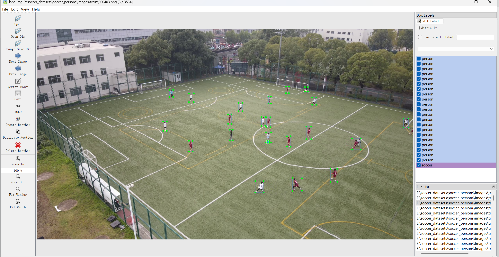

# SoccerEDMF: Enhanced Dual-Model Framework for Precision Player
Tracking and Ball Detection in Soccer Videos


## Overview

This repo contains my implementation of a enhanced dual-model framework (SoccerEDMF) for tracking players and ball detection. 

## Installation

### github clone + pip

1. Clone the repo:

```bash
git clone https://github.com/JianglangKang/SoccerEDMF.git
```

2. Install the dependencies:

```
conda create -n socceredmf python=3.8
conda activate socceredmf
pip install -r requirements.txt
```

## Dataset Preparation

1. Prepare a custom dataset containing players and footballs, and annotate the images in YOLO format using LabelImg. An example of an annotated image is shown below:：



2. Confirm the directory structure is as follows:

```
dataset/
├---images/
     ---train/
     	---000001.png
     	---000002.png
     	---...
     ---test/
     ---val/
     
├---labels/
     ---train/
     	---000001.txt
     	---000002.txt
     	---...
     ---test/
     ---val/
├classes.txt
 
```

## Run Training

1. train yolov8:

```python
cd ultralytics-main/
yolo train data=datasets/soccer_persons/soccer_persons.yaml model=ultralytics/cfg/models/v8/yolov8-C2f-PKI.yaml epochs=200 batch=1 device=0
```

2. train yolov5:

```python
cd yolov5-master/
python train.py --data datasets/soccer_persons/soccer_persons.yaml --cfg models/yolov5x_ca.yaml --batch-size 2 --epoch 200 --device "0"
```

## Run Inference

```python
python main.py
```

#### credits

(Work in progress)
